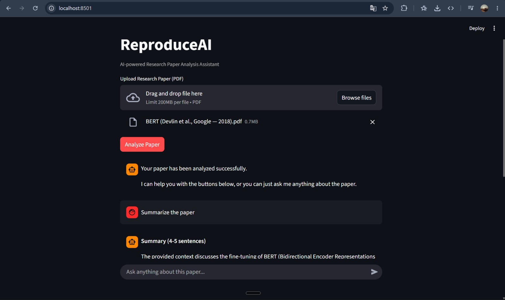
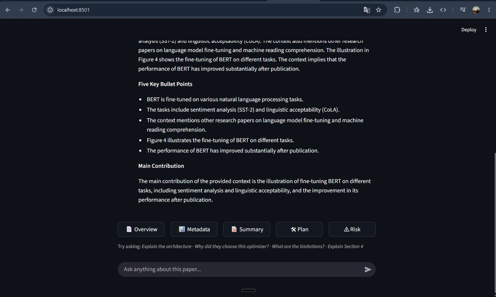

# ReproduceAI_V1
**AI Research Paper Analysis &amp; Reproduction Assistant**

ReproduceAI helps students, researchers, and machine learning engineers understand research papers and generate a structured roadmap for reproducing them — through a conversational, ChatGPT-style interface with built-in analysis tools.

Instead of functioning as another "Chat with PDF" application, ReproduceAI focuses on extracting important implementation details from research papers, organizing them into actionable outputs, and letting you explore the paper conversationally.

---

# Why ReproduceAI?

Reading research papers is only the first step.

Actually reproducing a paper requires identifying:

- datasets
- architectures
- optimizers
- learning rates
- batch sizes
- evaluation metrics
- implementation details

These details are often scattered throughout the paper, making reproduction time-consuming.

ReproduceAI automates this process by combining Retrieval-Augmented Generation (RAG) with structured metadata extraction, then presents everything through a single conversation — one-click tool buttons for the structured outputs, and free-form chat for anything else.

---

# Screenshots






inside an `images/` directory and reference them here.

---

# Features

Upload a research paper and start a conversation with it:

| Feature | Description |
|----------|-------------|
| 📄 Paper Overview | Title, authors, conference, publication year, research domain, and a one-line description |
| 📊 Structured Metadata | Dataset, architecture, optimizer, learning rate, batch size, epochs, loss function, hardware, metrics — extracted field-by-field, validated with Pydantic, with page citations |
| 📝 Paper Summary | A concise summary, key bullet points, and the main contribution |
| 🛠 Implementation Plan | Step-by-step implementation roadmap, required libraries, project structure, training and evaluation workflow |
| ⚠ Risk Analysis | Missing implementation details, reproduction challenges, and recommendations before implementation |
| 💬 Ask Anything | Free-form Q&A about the paper — architecture explanations, "why this optimizer?", equation walkthroughs, section summaries, limitations, etc. |

All five structured outputs are generated **once** during analysis and cached — clicking a tool button just displays the cached result instantly, with no additional API call. Only free-form chat questions call the LLM after the initial analysis.

---

# How It Works

```text
Upload Paper
     │
     ▼
Pipeline runs once
     │
     ▼
Cached report: { overview, metadata, summary, plan, risk }
     │
     ▼
Conversation begins
     │
     ├── Click a tool button → display cached result (no LLM call)
     │
     └── Type a question → Retriever → LLM → Answer (only path that uses Groq after analysis)
```

This keeps the app fast and minimizes API usage: a single analysis pass generates all five structured outputs up front, and the chat box is the only feature that makes further LLM calls.

---

# Architecture

```text
                    Research Paper (PDF)
                              │
                              ▼
                     PyMuPDFLoader
                              │
                              ▼
            RecursiveCharacterTextSplitter
                              │
                              ▼
             HuggingFace Embedding Model
         (sentence-transformers/all-MiniLM-L6-v2)
                              │
                              ▼
                         ChromaDB
                              │
                              ▼
                         Retriever
                              │
        ┌──────────┬──────────┬──────────┬──────────┐
        ▼          ▼          ▼          ▼          ▼
    Overview   Metadata    Summary     Planner      Risk
                              │
                              ▼
                      Conversation Layer
                              │
                              ▼
                    Free-form Chat (RAG)
```

The retriever and LLM instance are reused across the entire session — the same vector store powers the structured tools and the chat feature, so chat questions are answered using the exact context as the rest of the analysis.

---

# Design Philosophy

Instead of using the traditional approach

```text
Paper
   │
   ▼
Large Language Model
   │
   ▼
Everything
```

ReproduceAI follows a metadata-driven RAG pipeline.

```text
Paper
   │
   ▼
Retriever
   │
   ▼
Structured Metadata
   │
   ▼
Planner
   │
   ▼
Risk Analysis
```

This approach

- reduces hallucinations
- improves scalability
- keeps responses grounded in retrieved context
- enables downstream modules (planner, risk analysis, chat) to reuse structured metadata and the same retriever

---

# Tech Stack

### Programming Language
- Python

### Frameworks
- LangChain
- Streamlit (chat-based UI via `st.chat_message` / `st.chat_input`)

### Large Language Model
- Groq
- GPT-OSS-20B

### Embeddings
- sentence-transformers/all-MiniLM-L6-v2

### Vector Database
- ChromaDB

### PDF Processing
- PyMuPDF

### Validation
- Pydantic

---

# Project Structure

```text
ReproduceAI/
│
├── app.py
├── main.py
├── core.py
├── features.py
├── prompts.py
│
├── notebooks/
│   ├── reproduceai_v0.ipynb
│   └── README.md
│
├── data/
│   └── paper.pdf
│
├── requirements.txt
├── README.md
├── .gitignore
└── .env
```

---

# File Description

### app.py

Streamlit chat interface responsible for

- file upload and triggering analysis
- rendering the conversation (`st.session_state.messages`)
- tool buttons that inject cached analysis results into the conversation
- a chat input box that routes free-form questions through RAG

---

### main.py

Sequential pipeline that runs the full analysis once and hands back the retriever and LLM for reuse by chat.

```text
Load PDF

↓

Split Documents

↓

Create Vector Store

↓

Initialize Retriever

↓

Generate Overview

↓

Extract Metadata

↓

Generate Summary

↓

Generate Implementation Plan

↓

Generate Risk Analysis

↓

Return report, retriever, llm
```

---

### core.py

Infrastructure layer responsible for

- PDF loading
- document chunking
- embedding generation
- vector database creation (isolated per-paper collection)
- retriever creation
- LLM initialization

---

### prompts.py

Contains all prompt templates used throughout the application, including the chat prompt used for free-form Q&A.

Keeping prompts separate makes experimentation and prompt engineering easier.

---

### features.py

Business logic layer containing

- overview generation
- metadata extraction
- paper summarization
- implementation planning
- risk analysis
- free-form chat (`chat_with_paper`) — the RAG-based Q&A function powering the conversation

---

# Local Installation

Clone the repository

```bash
git clone https://github.com/<your-username>/ReproduceAI.git
cd ReproduceAI
```

Create a virtual environment

```bash
python -m venv venv
```

Activate the environment

Windows

```bash
venv\Scripts\activate
```

Linux / macOS

```bash
source venv/bin/activate
```

Install dependencies

```bash
pip install -r requirements.txt
```

Create a `.env` file

```text
GROQ_API_KEY=your_groq_api_key
```

---

# Running the Application

Run the Streamlit chat application

```bash
streamlit run app.py
```

Run the pipeline without the UI

```bash
python main.py
```

---

# Using the Chat Interface

1. Upload a research paper PDF and click **Analyze Paper**.
2. Once analysis completes, the assistant confirms readiness in the conversation.
3. Click any of the five tool buttons (📄 Overview, 📊 Metadata, 📝 Summary, 🛠 Plan, ⚠ Risk) to instantly inject that result into the conversation — no additional API call.
4. Type any question in the chat box — e.g. *"Explain the architecture"*, *"Why did they choose this optimizer?"*, *"What are the limitations?"*, *"Explain Section 4"* — and get an answer grounded in the paper's retrieved context.

---

# Future Improvements

- LangGraph multi-agent workflow — each tool button becomes a specialized agent (Overview Agent, Metadata Agent, Planner Agent, etc.) behind a Supervisor node, without changing the chat interface
- Hybrid Retrieval (Semantic + BM25)
- Cross-Encoder Reranking
- Multi-paper comparison
- Research report export (PDF)
- GitHub repository recommendation
- Starter code generation
- Persistent chat history across sessions

---

# Current Limitations

- Supports one research paper at a time.
- Extraction quality depends on the information available in the paper.
- Some implementation details may not be explicitly reported by the authors.
- Chat answers are limited to what the retriever surfaces from the uploaded paper — no external knowledge is used.

---

# About

Built by **Shaurya**, a B.Tech AI & ML student, as a hands-on project to explore Retrieval-Augmented Generation (RAG), structured information extraction, and conversational AI application design.

---

# License

This project is licensed under the MIT License.
